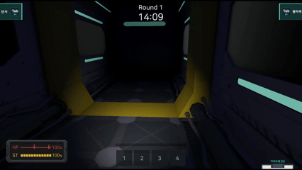
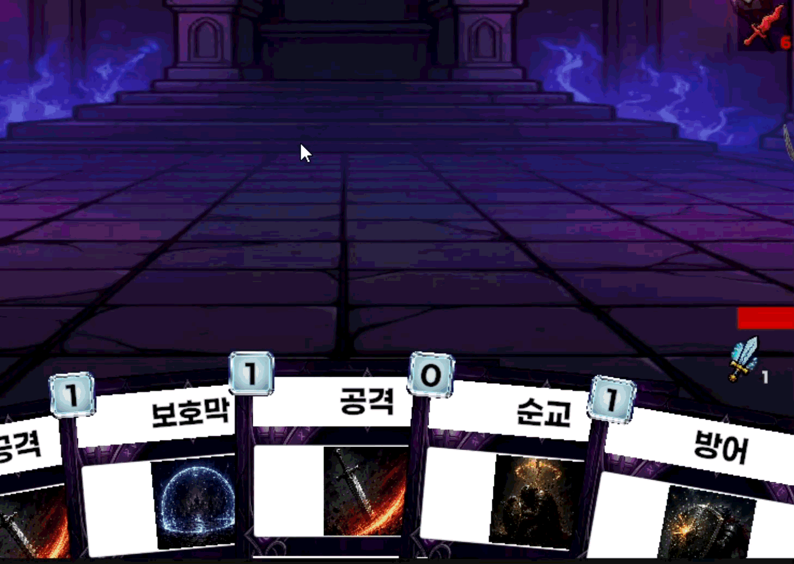

# 정호종 | 게임 클라이언트 개발자

> 데이터 흐름과 시스템 구조를 먼저 설계하여 구현 비용을 줄이는 게임 클라이언트 개발자 정호종입니다.

  
    
  

---

## 🎮 대표 출시작

<table>
  <tr>
    <td width="50%" align="center">
      <h3>미확인 개체 대응반</h3>
      
      

        <b>4인 협동 잠입 추리 멀티플레이 게임</b> 
        Unity 6 · C# · Netcode for GameObjects
      

      

        
         
        
      

    </td>
    <td width="50%" align="center">
      <h3>Break the Crown</h3>
      
      

        <b>덱빌딩 로그라이크 게임</b> 
        Unity 6 · C# · ScriptableObject
      

      

        
         
        
      

    </td>
  </tr>
</table>

### 그 외 프로젝트

| 프로젝트 | 핵심 기술 | 특징 및 장르 | 바로가기 |
| --- | --- | --- | --- |
| **쿠키런 스타일 2D 러너** | Unity, C# | FSM 기반 횡스크롤 2D 러너 캐릭터별 행동 확장 구조 설계 | [📦 GitHub 저장소](https://github.com/Devel-Rocket-ClassRoom/toy-project-0-team-8) |

---

## 💻 기술 스택

### 게임 개발

  
  
  
  

### 데이터 및 인프라

  
  
  
  

### 도구 및 협업

  
  
  

---

## 🧩 C++ 문제 해결 역량

> C++ 기반으로 자료구조와 알고리즘을 2년 이상 학습하며 300문제 이상 해결

- **[Baekjoon & Programmers 풀이 저장소](https://github.com/LteFroggy/CodingTest)**  
  백준 및 프로그래머스 주요 문제 C++ 풀이 코드 아카이빙
- **[CodeTree 풀이 저장소](https://github.com/LteFroggy/codetree-TILs)**  
  격자 탐색, 백트래킹, 동적 계획법, 자료구조 중심 일일 문제 해결 기록

---

## 🌐 게임 이전의 개발 경험

> 게임 클라이언트 전향 전 웹 백엔드 프로젝트에서 실시간 데이터 및 분산 처리를 다룬 경험

- **Nyam-Crew** — Redis 캐싱 및 랭킹 시스템, WebSocket 실시간 통신 파이프라인 구축
- **Moodbook** — AWS S3 미디어 업로드 및 JPA 지연 로딩 쿼리 최적화
